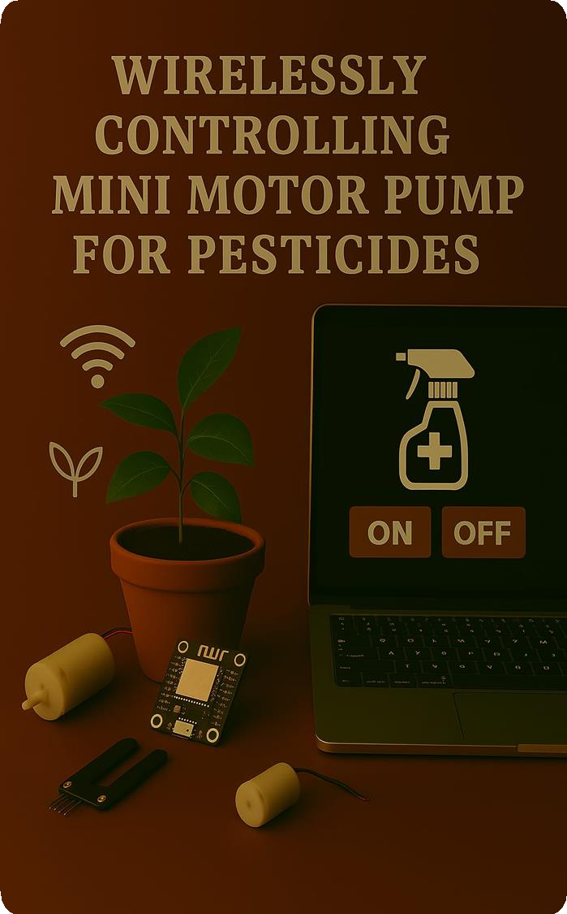

>  style="width:4.07292in;height:6.08333in" />***Title:SmartAgricultural***
> ***System***
>
> ***TeamLeader:***DebagnikRoy ***TeamMember:***
>
> SrayaDuttaChowdhury DebagnikRoy PijushDas
>
> ***Whatitis?***
>
> • Our SmartAgricultural System is amodern,wirelesssolutionthat
> automateskeyfarmingtaskslike plantmonitoring,watering,pest
> control,andfertilizer application.
>
> • Ithelpsfarmersincreasecrop yield, saveresources,andreduce manual
> workbyusingreal-time dataandremotecontrol technology.
>
>  style="width:4.88542in;height:6.19792in" />***Objectives***
>
> • Automatekeyagriculturaltasksusingwirelesstechnology
>
> • Monitor planthealthandenvironmentalconditionsinreal-time •
> Optimizewater,fertilizer,andpesticideusage
>
> • Reducemanuallabor and humanerror
>
> • Improvecrop yieldand overallfarmefficiency
>
> • Enableremotecontroland smartdecision-makinginfarming
>
>  style="width:4.72903in;height:6.79167in" /> style="width:0.57812in;height:0.48437in" /> style="width:0.57812in;height:0.48437in" /> style="width:0.57812in;height:0.48437in" /> style="width:0.57812in;height:0.48437in" /> style="width:0.57812in;height:0.48437in" /> style="width:0.57812in;height:0.48437in" /> style="width:0.57812in;height:0.48437in" /> style="width:0.57812in;height:0.48437in" /> style="width:0.57812in;height:0.48437in" />***KeyFeatures***
> **LivePlantMonitoring**
>
> **WirelessPestControl**
>
> **WirelessWateringSystem**
>
> **ArtificialLightControl**
>
> **ExcessWaterRemoval**
>
> **Temperature&** **HumidityMonitoring**
>
> **Soil** **Moisture** **Monitoring**
>
> **WirelessPesticide** **Spraying**
>
> **WirelessFertilizerDispensing**
>
>  style="width:7.84375in;height:3.16667in" /> style="width:0.84896in;height:0.70312in" />***Live*** ***Plant***
> ***Monitoring***
>
> •Videos aretransmitted **wirelesslytoa** **server**,viewable ona
> **webdashboard**.
>
> •Dataistransmittedwirelesslyto acentral server.
>
> •Farmerscanmonitor plantconditionsanytimeviaaweb dashboard.
>
> •Enablesquickdecisionsandremotecropmanagement from anywhere.
>
>  style="width:1.00521in;height:0.81771in" />**SoilMoisture**
> **Monitoring**
>
> • Soilmoisturesensorsareplaced near plantrootstodetect water
> levelsinrealtime.
>
> • Thesensor dataissentwirelesslytoa **centralserver**(viaWi-Fi).
>
> • Helpsinsmartirrigationbyshowingwhenandhowmuchto
> water,avoidingoverwateringor dryness.
>
>  style="width:4.13542in;height:6.19792in" /> style="width:0.99479in;height:0.81771in" />***WirelessPumpControl***
> ***for*** ***Watering***
>
> • Awater pumpisconnected toamicrocontroller (likeESP boardor Arduino).
>
> • Basedon**soilmoisturesensordata**,thesystemdecides
> whenwateringisneeded.
>
> • Thepump is **controlledwirelessly**viaWi-Fi.
>
> • Farmerscanalso**manuallystart/stopthepumpremotely** usinga server.
>
> • Ensuresefficientwater usageand reducesmanualeffort.
>
>  style="width:4.13542in;height:6.19792in" /> style="width:0.39062in;height:0.52604in" />**Temperature&HumidityMonitoring**
>
> • Usessensorslike**DHT11/DHT22**tomeasureambient temperatureand
> humidityinrealtime.
>
> • Sensor dataissent**wirelesslytoacentralserver**.
>
> • Valuesaredisplayedona **webdashboard**for remote monitoring.
>
> • Helpsinmaintainingoptimalenvironmentalconditionsfor plantgrowth.
>
>  style="width:4.13542in;height:6.19792in" /> style="width:0.85937in;height:0.70312in" />***WirelessFertilizerPumpControl***
>
> • A **motorpump**isconnectedtoaliquidfertilizer tank.
>
> • Controlled**wirelessly**viaamicrocontroller (e.g., ESP32) and
> communicationmodule(Wi-Fi).
>
> • Fertilizer applicationcanbe **automatedbasedon** **plant**
> **needs**or triggeredmanuallyfroma **mobile.**
>
> • Ensures**preciseanduniformdistribution** of fertilizer.
>
> • Reduceswasteandpromoteshealthier plant growth.
>
>  style="width:4.13542in;height:6.19792in" /> style="width:0.85937in;height:0.70312in" />***WirelessExcessWaterRemoval***
>
> • Sensorsdetect**excesswaterlevels** inthesoilor plantarea.
>
> • Whenflooding or overwatering is detected,a **drainagepump**
> **orvalve**isactivated**wirelessly**.
>
> • Controlledthrougha**microcontroller**and **mobile**
> **orserverinterface**.
>
> • Helps prevent**root** **rot**,soilerosion,andother
> water-relatedplantissues.
>
> • Ensuresoptimalsoilconditions andprotects crop health.
>
>  style="width:3.86458in;height:6.19792in" /> style="width:0.85937in;height:0.70312in" />***WirelessPesticide***
> ***Spraying*** ***System***
>
> • A **minimotorpump**isconnectedtoapesticide tankand spraymechanism.
>
> • Controlled**wirelessly**usingamicrocontroller (e.g.,ESP32) viaWi-Fi.
>
> • Ensures**timelyandtargetedspraying**,reducing
> chemicalwasteandprotectingplanthealth.
>
> • Helpsin**safe,efficientpestcontrol**without manualeffort.
>
>  style="width:4.13542in;height:6.19792in" /> style="width:0.84896in;height:0.70312in" />***WirelessMacroPest***
> ***Control***
>
> • Uses**cameras**todetect large pests like rodents, birds, or insects.
>
> • Ifapredator isdetected,wirelessly triggera buzzer systemfrom
> aremotelocation.
>
> • The suddensound startlesmice,exploiting their heightened sensitivity
> tonoise and vibration.
>
> • This instinctive reactioncauses them tofleethe area immediately.
>
> • Helpsin safeguardingthe crops orstorageareas withoutusingharmful
> repellents.
>
>  style="width:0.85937in;height:0.70312in" /> style="width:5.96875in;height:5.97917in" />**ArtificialLightforPhotosynthesis**

• Uses**LED** **grow** **lights** toprovide the necessarylight
spectrumfor photosynthesis.

• Especiallyusefulduring **low** **sunlightconditions**, indoor farming,
or night-time growth.

• Lightsare**controlled** **wirelessly**via amicrocontroller and canbe:

> • Turnedon/off, brightnesscontrolremotelythrough a **mobiledevice.**
>
> • Promotes**healthy** **plantgrowth** and ensures
> continuousphotosynthesis.

• Helps extendgrowing hours and improvecrop yield.

> ***TechnologiesUsed***
>
> • IoT(InternetofThings)
>
> • Wirelesscommunication(WiFi)
>
> • Microcontrollers(Arduino,ESP32, )
>
> • Sensors:DHT11/22 (Temp/Humidity),SoilMoisture,LDR
> (light),IR/Camera(for pests)
>
> • Actuators:Water pump,solenoidvalve,lights,sprayers
>
> • ProgrammingLanguagefor server :html,css, javascript, c++
>
>  style="width:0.99479in;height:0.81771in" />***What*** ***MakesOur***
> ***ProjectUnique***

•
**FullyWirelessControl**–Nomanualswitches or wiring needed.

•
**MobileAccessWithoutStorageUse**–Worksevenifthemobiledevicehasnointernalstorageleft.

• **Dedicated**
**Server-BasedControl**–Allwirelessoperationsarehandledthroughacentralserver.

• **MacroPest**
**Detection**–Detectsand controlslargepestsautomatically.

•
**SmartResourceUse**–Efficientuseofwater,fertilizers,and pesticides.

•
**All-in-OnePackage**–Multipleadvancedfeaturesinonecompactsystem.

•
**Affordable&Scalable**–Cost-effectiveand easytoexpandfor anyfarmsize.

> ***Conclusion***
>
> Our **SmartAgriculturalSystem**combines advanced
> wirelesstechnologywithreal-time monitoringtomakefarmingmore
> **efficient,automated,andsustainable**.
>
> Byofferingawiderangeoffeatures—likepestcontrol,irrigation,fertilization,and
> environmentalmonitoring—ina**single,server-basedpackage**,weaimtoreducelabor,
> optimizeresourceuse,andboostcrop productivity.
>
> Thisprojectisasteptoward the**futureof**
> **agriculture**:smart,scalable,andaccessibletoall.
